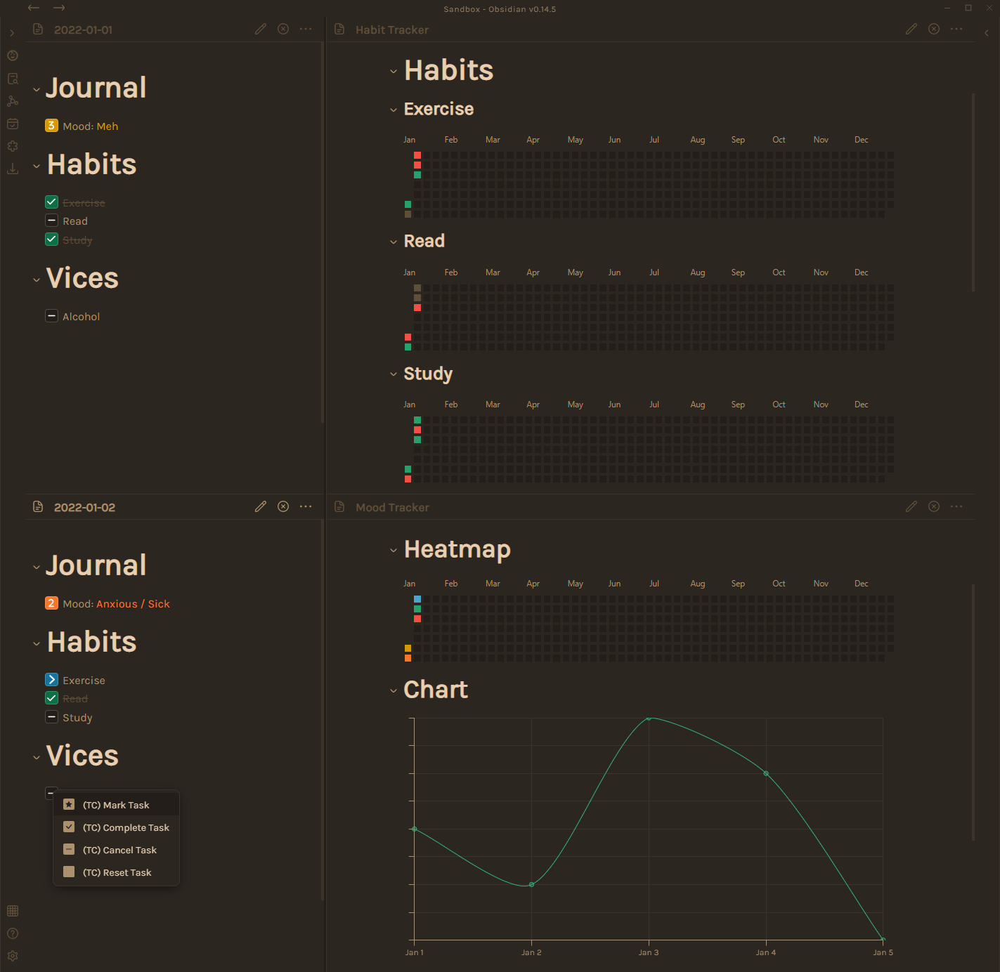
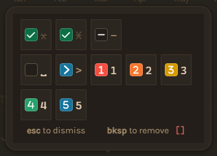

# Habit & Mood Tracker

This guide explains my implementation of habit and mood tracking in [Obsidian](https://obsidian.md/) using daily notes, custom checkboxes and GitHub-style heatmaps or charts.



Feel free to tweak this for your own set-up. For example, you may want to display your data in a streak calendar using the [Obsidian Tracker](https://github.com/pyrochlore/obsidian-tracker) plugin.

> **Note:** I'm pretty new to Obsidian and JS, so I'm sure there are simpler or more efficient ways of achieving the same results.
> If you have any suggestions, I'd love to learn from you and will happily credit you on this guide.

## Prerequisites

#### Core Plugins

- **[Daily Notes](https://help.obsidian.md/Plugins/Daily+notes)** - *required* - adds daily note feature for journalling and tracking, though you may want to use [Periodic Notes](https://github.com/liamcain/obsidian-periodic-notes) as an alternative for weekly/monthly/yearly notes and more templating options

#### Community Plugins

- **[Dataview](https://github.com/blacksmithgu/obsidian-dataview) >= beta v.0.5.0** - *required* - queries information and populates tracker
- **[Heatmap Calendar](https://github.com/Richardsl/heatmap-calendar-obsidian)** - *required* - displays tracked information in a heatmap
- **[Obsidian Charts](https://github.com/phibr0/obsidian-charts)** - *required* - displays tracked information in an interactive chart
- **[Custom JS](https://github.com/samlewis0602/obsidian-custom-js)** - *recommended* - simplifies codeblocks with reusable scripts and variables
- **[Task Collector (TC)](https://github.com/ebullient/obsidian-task-collector)** - *recommended* - toggles custom checkbox values in preview mode
- **[Obsidian BRAT](https://github.com/TfTHacker/obsidian42-brat)** - *recommended* - installs and updates beta versions of plugins or themes (ie. Dataview)
- **[Snippetor](https://github.com/ebullient/obsidian-snippetor)** - *optional* - styles custom checkboxes from a user interface (the same results can be achieved with CSS snippets as outlined in this guide)

## Example Files

```
.
├── .obsidian
│	└── snippets
│		└── trackers.css           # Enable this snippet under "Appearance"
├── Daily Notes
│	├── 2022-01-01
│	├── 2022-01-02
│	├── 2022-01-03
│	├── 2022-01-04
│	└── 2022-01-05
├── Resources
│	├── Scripts
│	│	├── Heatmaps.js            # Custom JS script for heatmap styling
│	│	└── Charts.js              # Custom JS script for chart styling
│	└── Templates
│		└── Daily Note.md          # Example daily note template
├── Habit Tracker.md                       # Example using dynamic colours and Custom JS
├── Habit Tracker - no CJS.md              # Example using static colours  
├── Mood Tracker.md                        # Example using dynamic colours and Custom JS
└── Mood Tracker - no CJS.md               # Example using static colours  
```

#### Primary Theme

These are files that have already been customised for the [Primary Theme](https://github.com/ceciliamay/obsidianmd-theme-primary).

```
.
├── .obsidian
│	└── snippets
│		└── trackers.css           # Enable this snippet under "Appearance"
└── Resources
	└── Scripts
		└── Heatmaps.js            # Custom JS script for heatmap styling
```

## Guide

### Setting up your plugins

#### Dataview

The trackers are populated through Dataview task queries. Custom checkboxes status queries (ie. `-` for cancelled, `>` for rescheduled/skipped) are only available in the beta version (v.0.5.0 or above), so you'll need to do a manual install or use [Obsidian BRAT](https://github.com/TfTHacker/obsidian42-brat).

| Setting                   | Value |
| ------------------------- | ----- |
| Enable JavaScript Queries | `ON`    |

#### Custom JS

If you are using a custom theme, you may want to use already-defined colours and styles in your heatmaps and charts. Custom JS makes this a lot easier.

| Setting | Value             |
| ------- | ----------------- |
| Folder  | `Resources/Scripts` |

#### Task Collector (TC)



Task Collector allows for right-click marking of tasks and checkboxes in preview mode. This makes it really easy to quickly log your mood and habits.

| Setting                                 | Value    |
| --------------------------------------- | -------- |
| Support cancelled tasks                 | `ON`     |
| Additional task types                   | `>12345` |
| Right-click Menu Items                  |          |
| └── Add menu item for marking a task    | `ON`     |
| └── Add menu item for completing a task | `ON`     |
| └── Add menu item for resetting a task  | `ON`     |

### Enable the snippet

Download the CSS snippet (`.obsidian → snippets → trackers.css`) and enable it in the "Appearance" settings of Obsidian. This stylesheet has been tested on the default Obsidian theme, so you may need to tweak it for your preferred theme.

> Users of the Primary theme, can download a ready-to-go version of the snippet (`Primary Theme → .obsidian → snippets → trackers.css`).

### Setting up your daily note template

Download the example template (`Resources → Templates → Daily Note.md`) or insert the markdown below into your existing daily note template.

```
# Journal
- [ ] Mood: 

# Habits
- [ ] Exercise
- [ ] Read
- [ ] Study

# Vices
- [ ] Alcohol
```

You can change the habit names as much as you like, but if you change the mood text or heading names (ie. "Journal", "Habits", "Vices") you'll also need to update the tracker pages.

### Creating the mood trackers

Install the Custom JS scripts (`Resources → Scripts → Heatmaps.js` and `Resources → Scripts → Charts.js`) and add the codeblocks below to a new page.

> Users of the Primary theme, can download a ready-to-go version of the heatmap script (`Primary Theme → Resources → Scripts → Heatmaps.js`).

Don't forget to change the text in `p.text.includes("Mood")` if you have changed the mood text in your template.

```
# Heatmap

```dataviewjs

const {Heatmaps} = customJS

const calendarData = {
	year: moment().year(),
	colors: {
		1: Heatmaps.entryColor('red'),
		2: Heatmaps.entryColor('orange'),
		3: Heatmaps.entryColor('yellow'),
		4: Heatmaps.entryColor('green'),
		5: Heatmaps.entryColor('blue'),
	},
	intensityScaleStart: 1,
	intensityScaleEnd: 5,
	entries: []
}

for(let page of dv.pages('"Daily Notes"').file.tasks.where(p=>p.checked).where(p=>p.text.includes("Mood")).sort(p=>p.path)){
    calendarData.entries.push({
        date: Heatmaps.fileDate(page.path),
		color: page.status,
		intensity: 5
    })
}
	
renderHeatmapCalendar(this.container, calendarData)
```

```
# Chart

```dataviewjs
const {Charts} = customJS

const pages = dv.pages('"Daily Notes"').file.tasks.where(p=>p.checked).where(b=>b.text.includes("Mood")).sort(p=>p.path)
const labels = pages.map(b=>Charts.fileDate(b.path))
const mood = pages.map(b=>b.status)

const chartData = {
    type: 'line',
    data: {
        labels: labels.values,
        datasets: [{
            backgroundColor: Charts.fillColor('green'),
            borderColor: Charts.borderColor('green'),
            borderWidth: 1,
            label: 'Mood',
            data: mood.values,
            spanGaps: true,
            tension: 0.25,
            fill: '1'
        }]
    },
    options:{
		scales: {
			y: {
				grid: {
					borderColor: Charts.textColor(),
					tickColor: Charts.textColor(),
					color: Charts.gridColor()
				},
				ticks: {
					display: false
				},
				min: 1,
				max: 5
			},
			x: {
				grid: {
					borderColor: Charts.textColor(),
					tickColor: Charts.textColor(),
					color: Charts.gridColor(),
				},
				ticks: {
					color: Charts.textColor(),
					font: {
					    family: Charts.fontFamily()
				    }
				},
				type: 'time',
				time: {
					unit: 'day',
					tooltipFormat: 'MMM D, YYYY'
				}
			}
		},
		interaction: {
            mode: 'index'
        },
        plugins: {
	        legend: {
		        display: false
	        }
        }
	}
}

window.renderChart(chartData, this.container)
```

If you would prefer not to use Custom JS, take a look at the example provided in `Mood Tracker - no CJS.md`.

### Creating the habit tracker

Install the Custom JS script (`Resources → Scripts → Heatmaps.js`) and add the code below to a new page.

Change the habit name (`p.text.includes("Exercise")`) accordingly, and duplicate as many times as you like for each habit. You should also change the section title (`String(p.section).includes("Habits")`), if you have changed the header titles in your daily note.

```
# Exercise

```dataviewjs

const {Heatmaps} = customJS

const calendarData = {
	year: moment().year(),
	colors: {
		"x": Heatmaps.entryColor('green'),
		"-": Heatmaps.entryColor('red'),
		">": Heatmaps.entryColor('faint')
	},
	intensityScaleStart: 1,
	intensityScaleEnd: 5,
	entries: []
}

for(let page of dv.pages('"Daily Notes"').file.tasks.where(p=>p.checked).where(p=>String(p.section).includes("Habits")).where(p=>p.text.includes("Exercise"))){
    calendarData.entries.push({
        date: Heatmaps.fileDate(page.path),
		color: page.status,
		intensity: 5
    })
}

renderHeatmapCalendar(this.container, calendarData)
```

If you would prefer not to use Custom JS, take a look at the example provided in `Habit Tracker - no CJS.md`.

## Wishlist

There are a few things I'm looking to add for my personal use-case, such as:

- Bar chart showing number of habits or vices completed each day
- Chart gradient colours aligned to mood colour

If you have any tips on how to achieve any of the above, please let me know.
